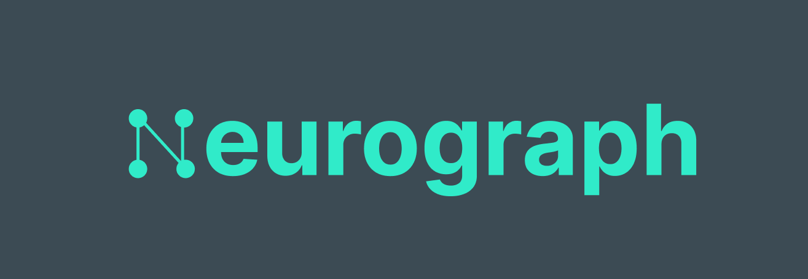

# 

* Experiment and research algorithms in graph theory and understand it's applications
* Use graph theory concepts for deep learning architectures
* Create data manipulation tools that utilize graph representations

# Table of Contents

* [Data Extraction](Projects/Neurograph/Design/Data%20Extraction/Data%20Frame.md)
* [Data Structures](Set.md)
* [Deep Learning](Deep%20Learning/MLP)
* [Graph Algorithms](Algorithms.md)
* [User Interface](User%20Interface/User%20Interface)

# Design

* Internal map of the core library behind neurograph
* Python library acts as high level user interface for core library
* Allows users to create GNN's and manipulate data 
* Build data pipelines with graph theory concepts

```mermaid
flowchart LR

A[Python Library] --> C[CoreLibrary]
C[Core Library] --> B[Graph Theory]
C[Core Library] --> D[Deep Learning]
C[Core Library] --> E[Data Extraction]
C[Core Library] --> F[Data Structures]
D[Deep Learning] --> G[Graph NN's]
B[Graph Theory] --> G[Graph NN's]
E[Data Extraction] --> H[Data Manipulation]
F[Data Structures] --> H[Data Manipulation]

```

# Dependency Structure

* Dependency structure of the code for neurograph
* Graph and Deep learning library should depend on data structures and extractors
* Data structures and extractors should not depend on the graph or DL library

```mermaid
flowchart LR

A[Graph Library] --> B[Data Structures]
A[Graph Library] --> C[Extractors]
D[Deep Learning] --> B[Data Structures]
D[Deep Learning] --> C[Extractors]

C[Extractors] --> B[Data Structures]

```

